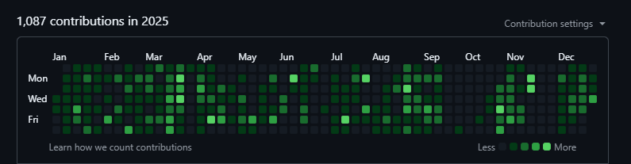
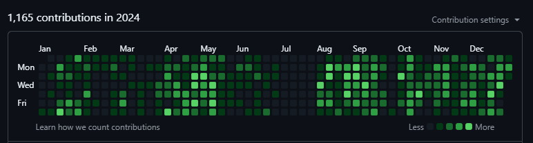
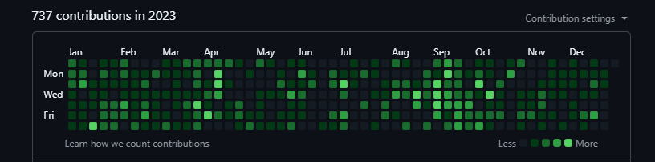
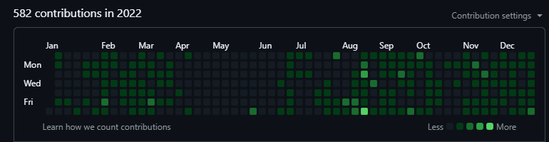

# Hi, I'm Zaki 👋

### Full-Stack Developer

I'm interested in **web development, full-stack applications with next js, and building real-world projects**.

---

## 💻 Tech Stack

**Languages & Frameworks**

**Styling & UI**

**Tools & Libraries**

---

## 🚀 What I Do

* Build full-stack web applications
* Create responsive and modern user interfaces
* Work with React and Next.js
* Design and integrate databases and backend services
* Deploy and maintain web applications
* Learn and experiment with new technologies
---

## 📊 GitHub Stats

---

## 📈 GitHub Activity

### 2025

### 2024

### 2023

### 2022

## 📫 Connect With Me

---

> Building, learning, and improving one project at a time.
